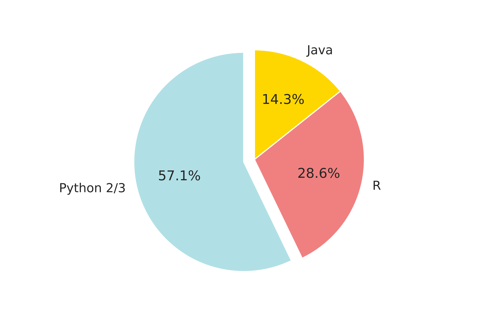
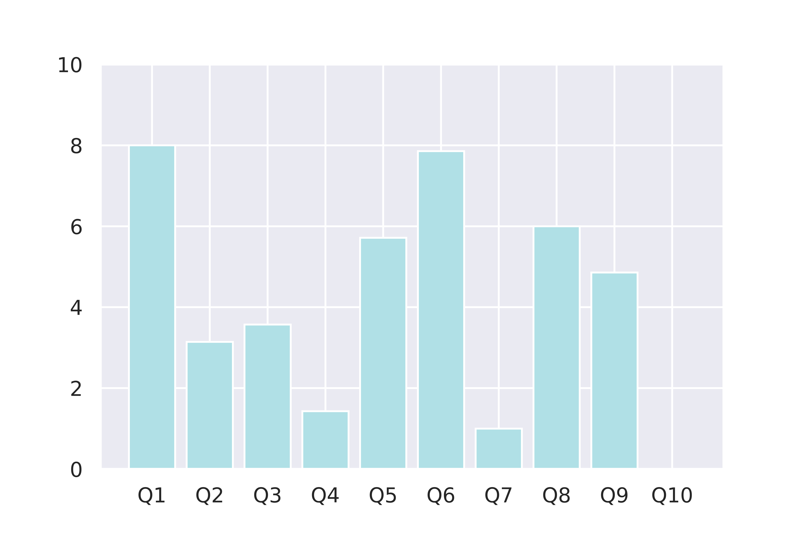

# Technical interview in July 2020
PhD in bioinformatics/biostatistics

## Test statistics
Six candidates were short-listed for the technical interview at MOS, one at a foreign institute. 
### 1. Choice of programming languages

  

### 2. Average scores of 10 questions

## General feedback by question
Q1. statisfactory performance with the highest average score. However, it is observed that candidate spent too much time (~10 mins), indicating that they were not very familiar with basic list and set operation

Q2. moderate performance, many candidates seem to be oblivious about the data type `string` and had little idea in common string operation

Q3. moderate performance indicates inadequate knowledge in the concept of sample vs population statistics. (Indeed, the answers could have been guessed with some common sense: the general reason of using more samples is to reduce sample variance and avoid extreme.)

Q4. only one candidate got the correct answer (I am impressed!), most candidates were unable to differentiate normal distribution and standard normal distribution (which is a special case of normal distribution)

Q5. satisfactory performance, most candidates got at least 5a correct.

Q6. satisfacotry performance, most candidates were familiar with the basic conditional operators and iteration

Q7. no candidates could correctly compute the maximum, indicating inadequate experience in programming, especially in the use of variable

Q8. satisfactory performance, most candidates understood the concept of recurrence, though computing it using iteration reminded a challenge

Q9. moderate performance. Q9 is very similar to Q8, only that one had to compute the two preceding terms (in addition to one). Only two candidates got the correct answer: one with recursion and one with iteration, I am very impressed!

Q10. no one could secure any marks from Q10. Indeed, the number-of-route problem is a combinatorics in a disguised form. If you are interested, please see the detailed explaination in the suggested answer.

## General advice
1. If you use Python 2, switch to Python 3 ASAP!
2. Code more, code more, and code more!

$*$ If you have questions, please do not hesitate to contact me via email(tinaho_ok@hotmail.com) or [LinkedIn](https://www.linkedin.com/in/tianlin-he-b8332b98/)

$*$ You may freely use and spread the questions and answers as you wish. Just direct to this address: [bioinf-stat-interview](https://github.com/tianlinhe/hannover)

